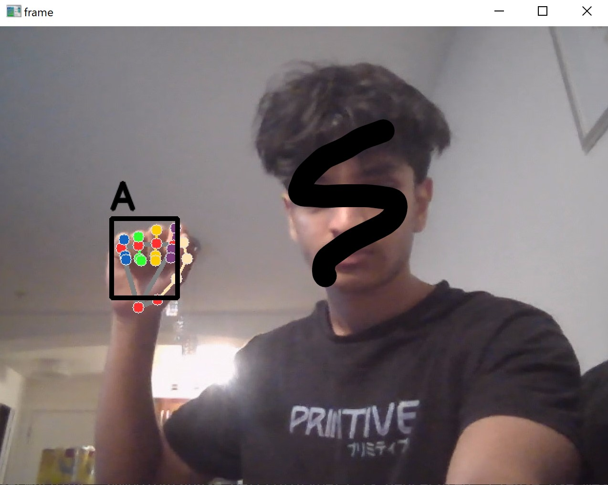
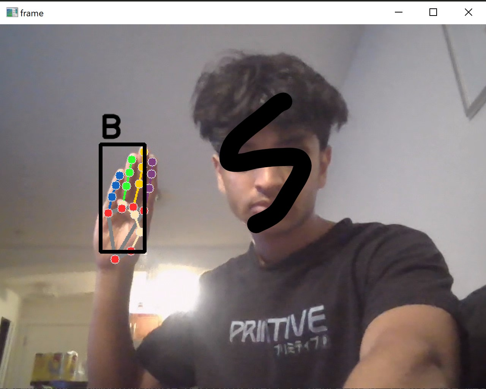
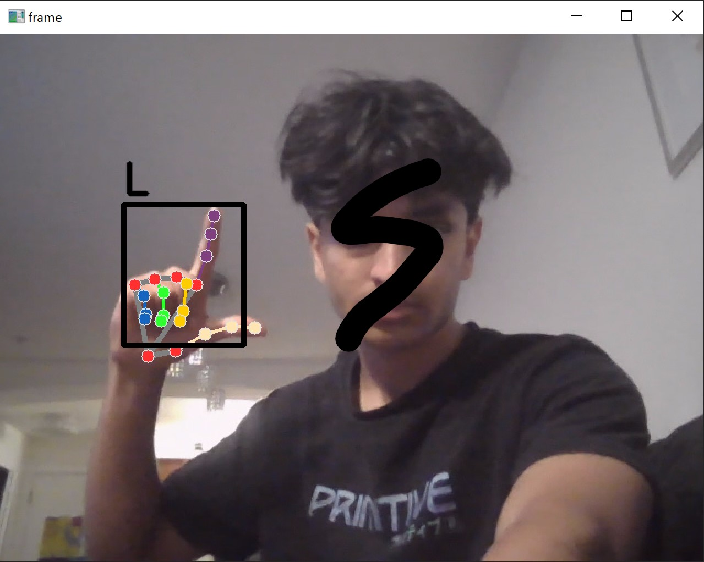

# Hi! Welcome to my first computer vision project.

## What it does
As the name suggests this is a simple sign language detector that can be used for people who are learning American Sign Language (ASL).

## How it does it
Using python, meadiapipe and opencv I was able to analyse data from the webcam and also identify landmarks on the hand that can be used to create datasets of x and y coordinates. Using these datasets, I was able to train a random forest classifier using scikit-learn to create a sign language model that achieved a 100% cross validation score. Putting it all together, the model can be used in real time in conjuction with opencv to detect hand signs.

## How to try it out
1. Pull the project/Download a zip and open in an IDE of your choice
2. Run the files in the order
    1. collect_imgs  (Follow the steps on screen to collect images)
    2. create_dataset
    3. train_classifier (This should reveal the classifier score in the console)
    4. test_classifier (Final file that should run the model in real time)

## Example Images

